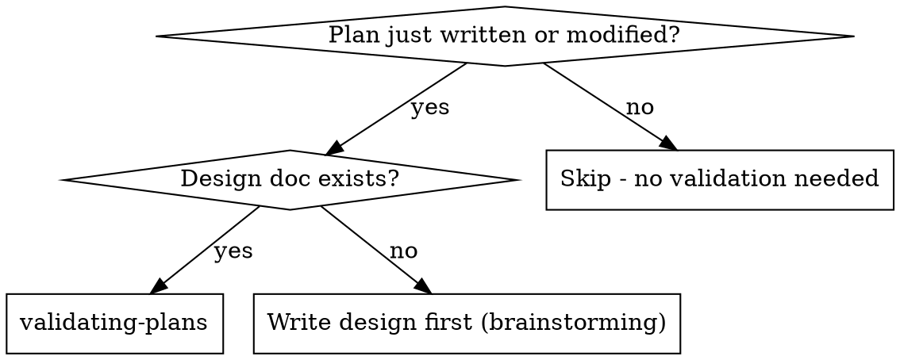
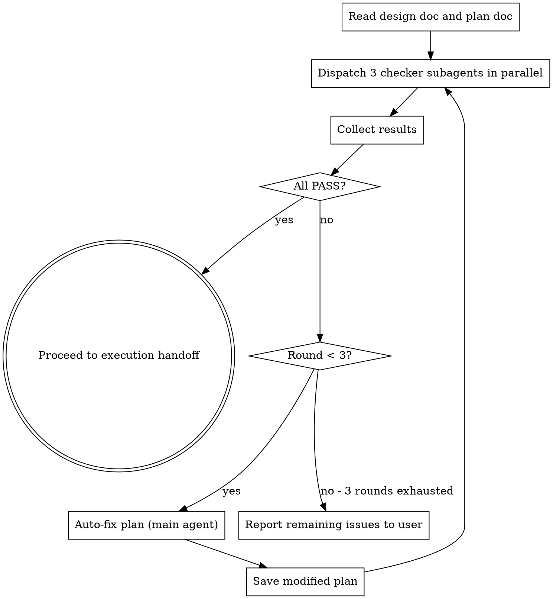

# Plan-Design Validation Implementation Plan

> **For Claude:** REQUIRED SUB-SKILL: Use superpowers:executing-plans to implement this plan task-by-task.

**Goal:** Add a `validating-plans` skill that dispatches three subagents (coverage, scope, intent) to verify plan-design consistency before execution begins.

**Architecture:** New skill directory `skills/validating-plans/` with SKILL.md and three subagent prompt templates. Modify `skills/writing-plans/SKILL.md` to invoke validation before offering execution options.

**Tech Stack:** Markdown skill files following superpowers plugin conventions

**Design doc:** `docs/plans/2026-02-18-plan-design-validation-design.md`

---

### Task 1: Create validating-plans SKILL.md

**Files:**
- Create: `skills/validating-plans/SKILL.md`

**Step 1: Create the skill directory and main file**

Create `skills/validating-plans/SKILL.md` with the following exact content:

````markdown
---
name: validating-plans
description: Use after writing-plans completes to validate plan-design consistency before execution - also use when a plan has been modified and needs re-validation
---

# Validating Plans

## Overview

Validate that an implementation plan is consistent with its design document. Dispatches three independent subagents to check coverage, scope, and intent alignment. Auto-fixes mismatches and gates execution until validation passes.

**Announce at start:** "I'm using the validating-plans skill to check plan-design consistency."

**Context:** This runs after writing-plans saves the plan, before any execution begins.

## When to Use



## Input

- **Design doc path** — `docs/plans/YYYY-MM-DD-<topic>-design.md`
- **Plan doc path** — `docs/plans/YYYY-MM-DD-<topic>-plan.md`

Both paths should be known from the writing-plans session. If not, ask the user.

## The Process



### 1. Read Both Documents

Read the full design doc and plan doc. Identify:
- Design doc path
- Plan doc path
- Current validation round (starts at 1)

### 2. Dispatch Three Checker Subagents in Parallel

Use `superpowers:dispatching-parallel-agents` pattern. Dispatch all three simultaneously:

- **Coverage Checker** — `./coverage-checker-prompt.md`
- **Scope Checker** — `./scope-checker-prompt.md`
- **Intent Checker** — `./intent-checker-prompt.md`

Each subagent receives the full text of both the design doc and plan doc (do NOT make them read files — provide full text inline, same pattern as subagent-driven-development).

### 3. Collect and Evaluate Results

Wait for all three subagents to return. Evaluate:
- If all three return PASS → proceed to execution handoff
- If any return FAIL → enter auto-fix loop

### 4. Auto-Fix Loop (if needed)

**Main agent performs fixes** (not subagent — fixing needs holistic understanding of both documents).

1. Collect all FAIL reports from the three checkers
2. Apply consolidated fix to the plan:
   - **Coverage FAIL** → Add new tasks to cover missing design requirements
   - **Scope FAIL** → Remove or revise tasks that exceed design scope
   - **Intent FAIL** → Modify task implementation approach to match design decisions
3. Save the modified plan file
4. Re-dispatch all three checkers (a fix for one issue may affect others)
5. Repeat until all pass or 3 rounds exhausted

**If 3 rounds exhausted:**
- Report all remaining FAIL items to the user
- List specific unresolved issues
- Ask user to decide: fix manually, accept as-is, or revise the design

### 5. Execution Handoff

After validation passes, present the same execution options as writing-plans:

**"Validation passed. Two execution options:**

**1. Subagent-Driven (this session)** - I dispatch fresh subagent per task, review between tasks, fast iteration

**2. Parallel Session (separate)** - Open new session with executing-plans, batch execution with checkpoints

**Which approach?"**

## Prompt Templates

- `./coverage-checker-prompt.md` — Checks every design requirement has plan coverage
- `./scope-checker-prompt.md` — Checks plan doesn't exceed design scope
- `./intent-checker-prompt.md` — Checks plan approach matches design architecture decisions

## Red Flags

**Never:**
- Skip validation because "the plan looks fine"
- Let a FAIL result pass without attempting fix
- Fix issues in subagents (main agent fixes, subagents only check)
- Dispatch checkers without providing full document text
- Proceed to execution with any unresolved FAIL (unless user explicitly accepts)
- Run more than 3 fix-validate rounds without user input

**If checker results conflict:**
- Coverage says "missing task X" but Scope says "task X is out of scope"
- → Report conflict to user, ask for design clarification
- Don't try to resolve design ambiguity automatically

## Integration

**Called by:**
- **superpowers:writing-plans** — Invoked automatically after plan is saved

**Calls:**
- **superpowers:dispatching-parallel-agents** — Pattern for parallel subagent dispatch

**Followed by:**
- **superpowers:subagent-driven-development** — If user chooses same-session execution
- **superpowers:executing-plans** — If user chooses parallel session execution
````

**Step 2: Verify the file was created correctly**

Run: `wc -w skills/validating-plans/SKILL.md`
Expected: Word count under 500 (per writing-skills guidelines for non-frequently-loaded skills)

**Step 3: Commit**

```bash
git add skills/validating-plans/SKILL.md
git commit -m "feat: add validating-plans skill skeleton"
```

---

### Task 2: Create coverage-checker-prompt.md

**Files:**
- Create: `skills/validating-plans/coverage-checker-prompt.md`

**Step 1: Create the coverage checker subagent prompt template**

Create `skills/validating-plans/coverage-checker-prompt.md` with the following exact content:

````markdown
# Coverage Checker Prompt Template

Use this template when dispatching a coverage checker subagent.

**Purpose:** Verify every design requirement has at least one corresponding plan task.

```
Task tool (general-purpose):
  description: "Check plan coverage against design"
  prompt: |
    You are checking whether an implementation plan fully covers its design document.

    ## Design Document

    [FULL TEXT of design doc]

    ## Implementation Plan

    [FULL TEXT of plan doc]

    ## Your Job

    Extract every requirement from the design document and check if the plan covers it.

    **What counts as a "requirement":**
    - Explicit features or functionality described in the design
    - Constraints or limitations specified
    - Success criteria or acceptance conditions
    - Architecture decisions that need implementation
    - Error handling or edge cases mentioned
    - Testing requirements stated in the design

    **How to check coverage:**
    For each requirement, find the specific plan task(s) that would implement it.
    A requirement is "covered" only if a plan task explicitly addresses it.
    Vague overlap doesn't count — the task must clearly implement the requirement.

    **Do NOT count as uncovered:**
    - Requirements that are implicitly covered by the overall architecture
      (only if truly implicit, not if they need explicit implementation)

    ## Output Format

    PASS or FAIL

    Coverage: X/Y design requirements have corresponding plan tasks

    If FAIL, list each uncovered requirement:
    - [Design section] "Requirement text" — No plan task addresses this

    If PASS:
    - All Y requirements traced to plan tasks
    - Brief mapping summary (requirement → task number)
```
````

**Step 2: Commit**

```bash
git add skills/validating-plans/coverage-checker-prompt.md
git commit -m "feat: add coverage checker subagent prompt template"
```

---

### Task 3: Create scope-checker-prompt.md

**Files:**
- Create: `skills/validating-plans/scope-checker-prompt.md`

**Step 1: Create the scope checker subagent prompt template**

Create `skills/validating-plans/scope-checker-prompt.md` with the following exact content:

````markdown
# Scope Checker Prompt Template

Use this template when dispatching a scope checker subagent.

**Purpose:** Verify the plan contains no tasks that go beyond the design scope (anti scope-creep).

```
Task tool (general-purpose):
  description: "Check plan scope against design"
  prompt: |
    You are checking whether an implementation plan stays within the scope of its design document.

    ## Design Document

    [FULL TEXT of design doc]

    ## Implementation Plan

    [FULL TEXT of plan doc]

    ## Your Job

    Check every plan task and verify it traces back to a design requirement.

    **For each plan task, determine:**
    1. Does this task directly implement a design requirement? → Traceable
    2. Is this a necessary engineering step? → Whitelisted (see below)
    3. Neither? → Out of scope

    **Whitelisted engineering steps (always acceptable):**
    - Writing tests for designed features
    - Project setup and configuration
    - Documentation for designed features
    - Committing and version control steps
    - Running verification commands
    - Creating necessary directory structure

    **Out of scope means:**
    - The task implements functionality not mentioned in the design
    - The task adds features, options, or capabilities beyond what the design specified
    - The task refactors or improves existing code not related to the design
    - The task adds "nice to have" items the design didn't request

    **Be strict but fair:**
    - A task that implements a design requirement using reasonable engineering
      practices (error handling for designed features, input validation for
      designed inputs) is NOT out of scope
    - A task that adds entirely new capabilities, endpoints, or features
      not mentioned in the design IS out of scope

    ## Output Format

    PASS or FAIL

    Plan tasks: N total
    - Traceable to design: X
    - Whitelisted engineering: Y
    - Out of scope: Z

    If FAIL, list each out-of-scope task:
    - Task N: "Task title" — Not traceable to any design requirement.
      What it does: [brief description]
      Why it's out of scope: [explanation]

    If PASS:
    - All tasks traceable or whitelisted
    - Brief summary of traceability
```
````

**Step 2: Commit**

```bash
git add skills/validating-plans/scope-checker-prompt.md
git commit -m "feat: add scope checker subagent prompt template"
```

---

### Task 4: Create intent-checker-prompt.md

**Files:**
- Create: `skills/validating-plans/intent-checker-prompt.md`

**Step 1: Create the intent checker subagent prompt template**

Create `skills/validating-plans/intent-checker-prompt.md` with the following exact content:

````markdown
# Intent Checker Prompt Template

Use this template when dispatching an intent checker subagent.

**Purpose:** Verify the plan's implementation approach matches the design's architecture decisions and intent.

```
Task tool (general-purpose):
  description: "Check plan intent alignment with design"
  prompt: |
    You are checking whether an implementation plan's approach is consistent
    with the architecture decisions and intent expressed in its design document.

    ## Design Document

    [FULL TEXT of design doc]

    ## Implementation Plan

    [FULL TEXT of plan doc]

    ## Your Job

    Extract architecture decisions from the design and verify the plan respects them.

    **What counts as an "architecture decision":**
    - Technology choices (language, framework, library, database)
    - Architectural patterns (REST vs GraphQL, monolith vs microservice)
    - Data flow decisions (sync vs async, polling vs events)
    - Storage decisions (file vs database, cache strategy)
    - Integration approaches (API style, protocol choices)
    - Design constraints (performance targets, compatibility requirements)
    - Component boundaries (what belongs where, separation of concerns)

    **How to check intent alignment:**
    For each architecture decision in the design, find how the plan implements it.
    Flag any plan task that uses a different approach than what the design specified.

    **What counts as a deviation:**
    - Design says "use Redis" but plan task uses in-memory cache
    - Design says "REST API" but plan implements GraphQL
    - Design says "event-driven" but plan uses polling
    - Design specifies component A handles X, but plan puts X in component B
    - Design says "3 independent subagents" but plan uses a single combined agent

    **What does NOT count as a deviation:**
    - Plan uses a reasonable implementation detail the design didn't specify
    - Plan chooses a specific library within the technology the design chose
    - Plan adds standard engineering practices (logging, error handling)
      consistent with the design's approach

    ## Output Format

    PASS or FAIL

    Architecture decisions found: N
    - Aligned: X
    - Deviated: Y

    If FAIL, list each deviation:
    - Design decision: "[what the design specified]"
      Plan approach: "[what the plan does instead]"
      Task(s): Task N, Task M
      Impact: [why this matters]

    If PASS:
    - All architecture decisions respected
    - Brief alignment summary
```
````

**Step 2: Commit**

```bash
git add skills/validating-plans/intent-checker-prompt.md
git commit -m "feat: add intent checker subagent prompt template"
```

---

### Task 5: Modify writing-plans SKILL.md to invoke validation

**Files:**
- Modify: `skills/writing-plans/SKILL.md:97-117` (Execution Handoff section)

**Step 1: Update the Execution Handoff section**

In `skills/writing-plans/SKILL.md`, replace the current "Execution Handoff" section (lines 97-117) with the following:

Find this text:
```
## Execution Handoff

After saving the plan, offer execution choice:

**"Plan complete and saved to `docs/plans/<filename>.md`. Two execution options:**

**1. Subagent-Driven (this session)** - I dispatch fresh subagent per task, review between tasks, fast iteration

**2. Parallel Session (separate)** - Open new session with executing-plans, batch execution with checkpoints

**Which approach?"**

**If Subagent-Driven chosen:**
- **REQUIRED SUB-SKILL:** Use superpowers:subagent-driven-development
- Stay in this session
- Fresh subagent per task + code review

**If Parallel Session chosen:**
- Guide them to open new session in worktree
- **REQUIRED SUB-SKILL:** New session uses superpowers:executing-plans
```

Replace with:
```
## Validation Gate

After saving the plan:

**REQUIRED SUB-SKILL:** Invoke superpowers:validating-plans to validate the plan against the design document before proceeding.

Do NOT offer execution options until validation passes. The validating-plans skill handles the execution handoff after validation succeeds.
```

**Step 2: Verify the modification**

Run: `grep -n "validating-plans" skills/writing-plans/SKILL.md`
Expected: Line(s) showing the new validation gate reference

**Step 3: Commit**

```bash
git add skills/writing-plans/SKILL.md
git commit -m "feat: add validation gate to writing-plans before execution"
```

---

### Task 6: Test the complete flow with a dry-run scenario

**Files:**
- No files created or modified (testing only)

**Step 1: Verify all files exist**

Run:
```bash
ls -la skills/validating-plans/
```
Expected: 4 files — SKILL.md, coverage-checker-prompt.md, scope-checker-prompt.md, intent-checker-prompt.md

**Step 2: Check word count for SKILL.md**

Run: `wc -w skills/validating-plans/SKILL.md`
Expected: Under 500 words

**Step 3: Verify writing-plans references validating-plans**

Run: `grep "validating-plans" skills/writing-plans/SKILL.md`
Expected: At least one reference to `superpowers:validating-plans`

**Step 4: Verify writing-plans no longer shows execution options directly**

Run: `grep "Subagent-Driven" skills/writing-plans/SKILL.md`
Expected: No matches (execution options moved to validating-plans)

**Step 5: Verify all prompt templates reference the correct Task tool pattern**

Run: `grep "Task tool" skills/validating-plans/*-prompt.md`
Expected: Three matches, all showing `Task tool (general-purpose):`

---

### Task 7: Final commit with all changes

**Files:**
- No new files (all committed in previous tasks)

**Step 1: Verify clean git status**

Run: `git status`
Expected: Clean working tree (all changes committed in Tasks 1-5)

**Step 2: Verify commit history**

Run: `git log --oneline -5`
Expected: 4 new commits for tasks 1-5 (some tasks may be combined)
