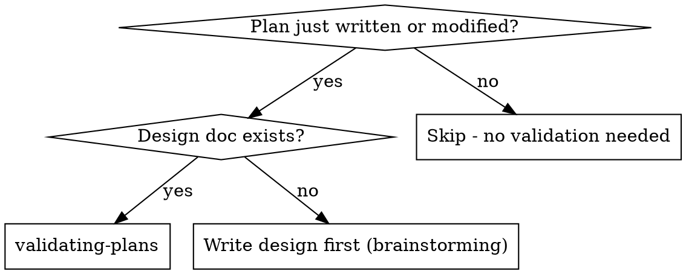
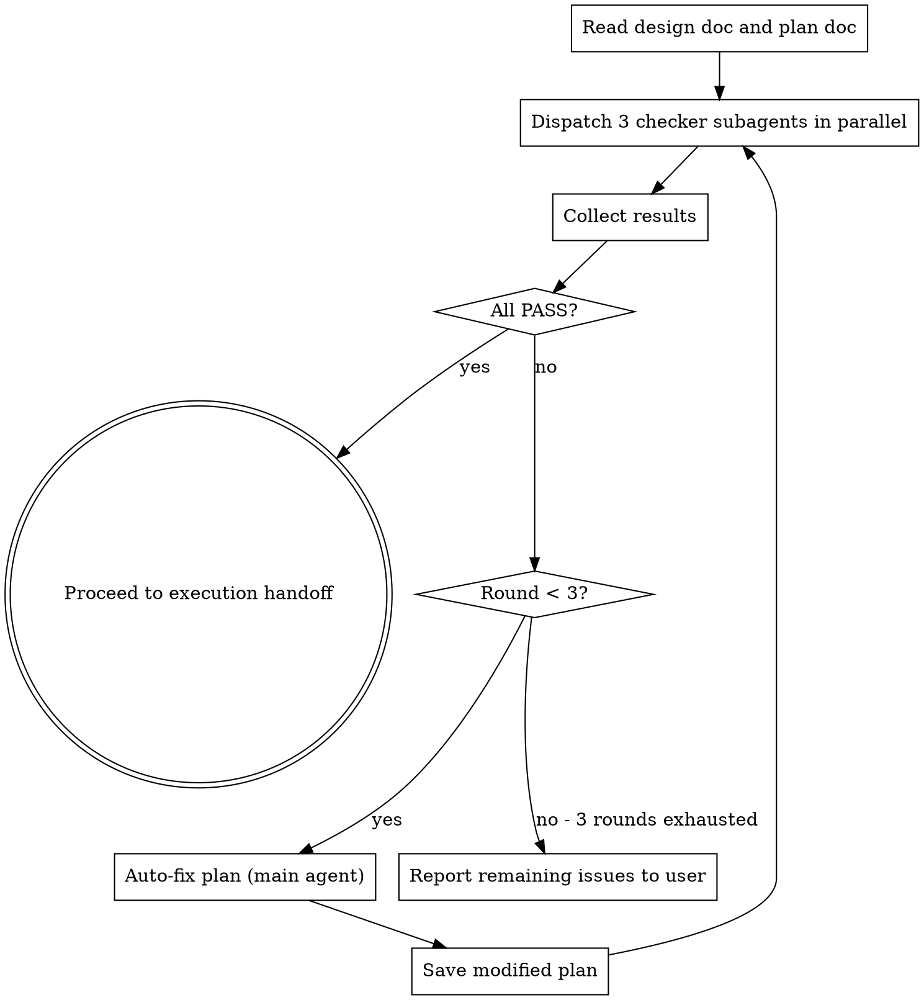

# Validating Plans

## Overview

Validate that an implementation plan is consistent with its design document. Dispatches three independent subagents to check coverage, scope, and intent alignment. Auto-fixes mismatches and gates execution until validation passes.

**Announce at start:** "I'm using the validating-plans skill to check plan-design consistency."

**Context:** This runs after writing-plans saves the plan, before any execution begins.

## When to Use

## Input

- **Design doc path** — `docs/plans/YYYY-MM-DD-<topic>-design.md`
- **Plan doc path** — `docs/plans/YYYY-MM-DD-<topic>-plan.md`

Both paths should be known from the writing-plans session. If not, ask the user.

## The Process

### 1. Read Both Documents

Read the full design doc and plan doc. Identify:
- Design doc path
- Plan doc path
- Current validation round (starts at 1)

### 2. Dispatch Three Checker Subagents in Parallel

Use `superpowers:dispatching-parallel-agents` pattern. Dispatch all three simultaneously:

- **Coverage Checker** — `./coverage-checker-prompt.md`
- **Scope Checker** — `./scope-checker-prompt.md`
- **Intent Checker** — `./intent-checker-prompt.md`

Each subagent receives the full text of both the design doc and plan doc (do NOT make them read files — provide full text inline, same pattern as subagent-driven-development).

### 3. Collect and Evaluate Results

Wait for all three subagents to return. Evaluate:
- If all three return PASS → proceed to execution handoff
- If any return FAIL → enter auto-fix loop

### 4. Auto-Fix Loop (if needed)

**Main agent performs fixes** (not subagent — fixing needs holistic understanding of both documents).

1. Collect all FAIL reports from the three checkers
2. Apply consolidated fix to the plan:
   - **Coverage FAIL** → Add new tasks to cover missing design requirements
   - **Scope FAIL** → Remove or revise tasks that exceed design scope
   - **Intent FAIL** → Modify task implementation approach to match design decisions
3. Save the modified plan file
4. Re-dispatch all three checkers (a fix for one issue may affect others)
5. Repeat until all pass or 3 rounds exhausted

**If 3 rounds exhausted:**
- Report all remaining FAIL items to the user
- List specific unresolved issues
- Ask user to decide: fix manually, accept as-is, or revise the design

### 5. Execution Handoff

After validation passes, present the same execution options as writing-plans:

**"Validation passed. Two execution options:**

**1. Subagent-Driven (this session)** - I dispatch fresh subagent per task, review between tasks, fast iteration

**2. Parallel Session (separate)** - Open new session with executing-plans, batch execution with checkpoints

**Which approach?"**

## Prompt Templates

- `./coverage-checker-prompt.md` — Checks every design requirement has plan coverage
- `./scope-checker-prompt.md` — Checks plan doesn't exceed design scope
- `./intent-checker-prompt.md` — Checks plan approach matches design architecture decisions

## Red Flags

**Never:**
- Skip validation because "the plan looks fine"
- Let a FAIL result pass without attempting fix
- Fix issues in subagents (main agent fixes, subagents only check)
- Dispatch checkers without providing full document text
- Proceed to execution with any unresolved FAIL (unless user explicitly accepts)
- Run more than 3 fix-validate rounds without user input

**If checker results conflict:**
- Coverage says "missing task X" but Scope says "task X is out of scope"
- → Report conflict to user, ask for design clarification
- Don't try to resolve design ambiguity automatically

## Integration

**Called by:**
- **superpowers:writing-plans** — Invoked automatically after plan is saved

**Calls:**
- **superpowers:dispatching-parallel-agents** — Pattern for parallel subagent dispatch

**Followed by:**
- **superpowers:subagent-driven-development** — If user chooses same-session execution
- **superpowers:executing-plans** — If user chooses parallel session execution
